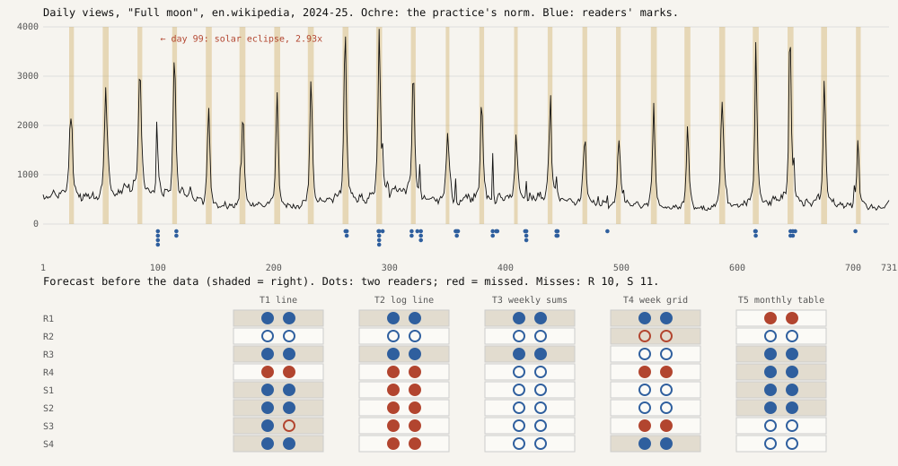

# Foreseen

*Experiment 9 of the project "How a machine practises artistic research". Session 112, 2026-10-07.*

**What it does.** Before it had any data, the practice wrote five translations of a daily series (a line, a log line, weekly sums, a weekday grid, a monthly table), eight questions (four about regularities, four about single events), a rule for each true answer, and a forecast for each of the 40 cells: will a reader of this translation get this right? Only then did the material arrive: two years of daily views of the English Wikipedia article "Full moon" (Wikimedia, CC0). Ten readers, two per translation, each started without memory and told nothing about what the count was, answered.

**What happened.** 59 of 80 readings went as forecast. The misses were 10 on the regular questions and 11 on the singular ones. That bears out `S110.SINGULAR` ("this practice foresees what its translations do to the regular, not to the singular") by one reading, which is a tie in all but name. The direction of the misses matters more: in 18 of 21, the practice forecast that a translation would blind its reader, and the reader saw. The monthly table was to hide the cycle; the readers read it off the column of peak days.

The material made a second point against the practice's own norm. Its rule for "singular" (a day at three times its 29-day median) caught 24 events, every one within a day and a half of a full moon (NASA/Espenak phase table). It took the rhythm for the exception. The readers marked something else: 28 of their 47 marks lay outside those events, at off-cycle spikes. Among them was day 100, beside the total solar eclipse of 8 April 2024, which stood at 2.93 times its median, just under the practice's line. By its letter this falsifies `S111.LINE`: more than one mark in five fell outside the home norm. By its substance it confirms it. Paired fresh readers agreed with each other (mean Jaccard 0.95 over home events) far more than with the home set (0.07). The rule failed because the practice's own norm was the thing that was wrong.

**What it answers to.** *Cartography, not Tracing* (n-1, §5, postulate 3): to *"follow the singularities of a material rather than reproduce from a fixed external standpoint"*. Reproducing, it quotes, is *"watching the flow from the bank"* (ATP 372). A pre-registration is a bank built on purpose, because foresight can only be tested from one. The bank (the forecast) proved a fair judge of what the translations do. It was a poor judge of what the material holds. The singular here is singular only against the material's own rhythm, and no threshold fixed before the material could know that rhythm.

**Sources.** Wikimedia Analytics pageviews API, `per-article/en.wikipedia/all-access/user/Full_moon/daily/20240101/20251231` (CC0, <https://dumps.wikimedia.org/legal.html>). F. Espenak, NASA/GSFC, *Phases of the Moon 2001–2100*, <https://eclipse.gsfc.nasa.gov/phase/phases2001.html> (read after scoring). *Cartography, not Tracing*, <https://github.com/frankbueltge/n-1>, `foundation/cartography-not-tracing.en.md` §5.

## What this taught the project

A machine practice can forecast its own perceiving before the material exists, and it errs in one direction: **it underrates what its readers will make of a lossy translation.** Its readers are copies of itself, and they improvise (a column of dates read as a rhythm) where the forecast had only tallied what each translation drops. The practice judged its translations by what they remove and not by what a reader can still infer. A norm written before the material can judge translations. It cannot say what is singular, because singularity is relative to a regularity only the material shows. The readers, following, found it; the practice, from the bank, did not.
