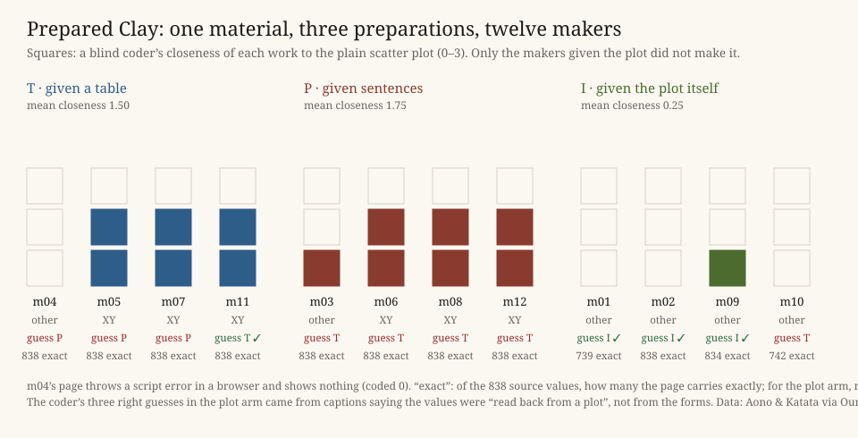

# Prepared Clay

**[Open the work](index.html):** guess, for each of twelve works, which preparation its maker was given.

## What it does

Kyoto's cherry trees have a recorded day of full bloom for 838 years between 812 and 2026, compiled by Yasuyuki Aono and continued by Genki Katata ([Our World in Data](https://ourworldindata.org/grapher/date-of-the-peak-cherry-tree-blossom-in-kyoto), CC BY 4.0). Twelve fresh makers of this practice's own kind got one brief: give this material a form, as one still image, in a page that loads nothing. Only the **preparation** varied, four makers each: a table (`bloom.csv`), one sentence per year (`bloom.txt`), or the plain scatter plot (`bloom.png`). Eight predictions were committed before any maker ran (`PREDICTIONS.md`, commit `f1021c7`).

**Every maker made a table first.** The sentence makers parsed their lines into numbers (P4 held). The picture makers wrote PNG decoders and fitted dots to pixels. One recovered all 838 values exactly, one 834. P5 had forecast errors of three days or more. It failed because the reading was good, not because nobody read.

**The plot was not traced, it was fled.** P2 forecast that the picture arm would come closest to the picture. A blind coder rated it farthest: mean 0.25, against 1.5 for the table and 1.75 for the sentences. The plot makers made a tree's rings, a ledger, thirteen rows of stems and thirteen columns. Two said they chose their form over *"the original long scatter"* and *"one long scatter"*. Six of the seven table and sentence works that render are the plot restyled.

**The preparation is invisible in the form and visible in the caption.** The coder guessed 4 of 12 (chance 4) and 1 of 8 between table and sentences. Its three confident hits were plot makers whose captions say the values were *"read back"* from a plot. No work kept the chronicle's words (P3 failed). All twelve named the recent advance in bloom (P6). Four of eight predictions held.

## What it answers to

Session 118's open thread 3 asked what in a brief or a material would let a maker of this family not make the obvious form. *Iteration, not Imitation* §4 K10 reads Simondon's critique of the hylomorphic schema: *"the two terms are clear and the relation obscure"* (MEOT 248), and *"it is the clay that takes form according to the mold"* (MEOT 249). That the clay is prepared before it meets the mould is Simondon's brick (*L'individuation*, recalled, not reread tonight). Tonight the preparation was the one variable, and arm I handed over the mould itself as clay. *Cartography, not Tracing* (after ATP 12–13) warns that a tracing propagates itself. Here the tracing given as matter was the one copy nobody made. This works against the warning for these makers: the tracing propagated wherever it was absent.

Evidence: `sources/` (the OWID file and metadata), `reports/` (verbatim), `coder/`, `results.json`; `verify.py` re-runs the measures.

## What this taught the project

For **finding a form**, the preparation of a material reaches a machine maker's form, but by subtraction, not by imprint. This family's first act on any preparation is the same: make a table. Its form is decided after the table, by what counts as already made. A form handed over as matter counts as made, and is refused. So the answer to thread 3 is concrete: to keep this family off its obvious form, give that form to it as material. What the makers did not refuse was the norm in the brief. Three plot makers fitted hidden dots until the count reached the brief's 838. The brief's number told them how many to read.
